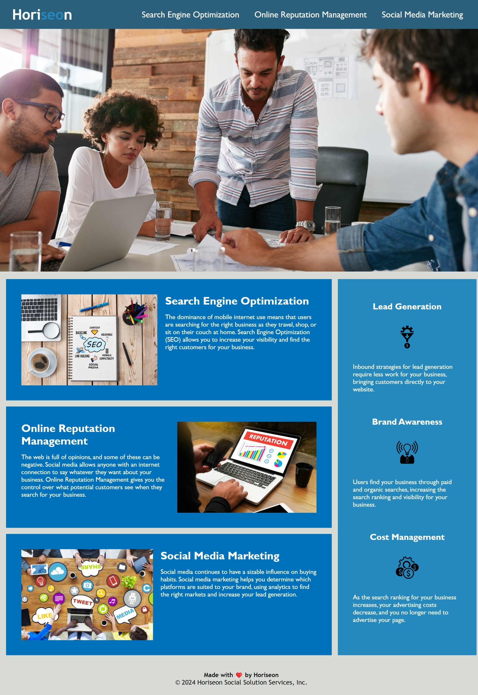

# [Module 1] Horiseon Code Refactor

### Project Overview

A codebase refactor to improve webpage:
- SEO
- Accessibility

This project was undertaken as part of a coding bootcamp. This was the first challenge exercise (homework assignment) that was assigned by my instructor.

### Details 

I was asked to refactor sample code by:
1. **Incorperating semantic elements**
2. **Adding comments**
3. **Removing repetitions**

### Requirements

The following were provided to define the scope of this assignment:

  
Agile Project Management Considerations

### 1. User Story:

    AS A marketing agency
    I WANT a codebase that follows accessibility standards
    SO THAT our own site is optimized for search engines

### 2. Acceptance Criteria:

    GIVEN a webpage meets accessibility standards
    WHEN I view the source code
    THEN I find semantic HTML elements
    WHEN I view the structure of the HTML elements
    THEN I find that the elements follow a logical structure independent of styling and positioning
    WHEN I view the image elements
    THEN I find accessible alt attributes
    WHEN I view the heading attributes
    THEN they fall in sequential order
    WHEN I view the title element
    THEN I find a concise, descriptive title

### 3. Mockup:

    This layout is designed for "desktop", so you may notice that some of 
    the elements don't look like the Mock-Up when viewed at a resolution 
    smaller than 768px. In future lessons, you will learn how to make 
    elements "responsive" so that your web application is optimized for any 
    screen size. The following image shows the web application's appearance 
    and functionality:

  
Provided Mockup Screenshot

  

### 4. Instructions for Submission:

    You are required to submit BOTH of the following for review:

    - The URL of the deployed application.

    - The URL of the GitHub repository that contains your code. Give the
    repository a unique name and include a README file that describes the 
    project.
    

## Takeaway
Bringing code up to current standards is a common problem for many websites. 

This project provided me with practice using git to methodically change HTML & CSS code as well as tracking and committing changes to the code.

This project also served as good practice and reinforcement of git, html, css, and markdown, as well as the ways that they interact and the conventions that govern them.

---

# Installation
If you wish to run this project locally on your own computer, (assuming you have git installed) input the following code in your terminal:

`git clone https://github.com/Iggys4ur/horiseon_refactor_seo.git <PATH_TO_DESTINATION_DIRECTORY>`

# Usage
The live site may be viewed at the following url:

- https://iggys4ur.github.io/horiseon_refactor_seo/

  
Screenshot of the page after this refactor

    

  

# Submission
GitHub repo
    - https://github.com/Iggys4ur/horiseon_refactor_seo/

Hosted Webpage
    - https://iggys4ur.github.io/horiseon_refactor_seo/

# Credits
The original files for this assignment may be found here if you wish to recreate this project:
- https://git.bootcampcontent.com/Rutgers-University/RUT-VIRT-FSF-FT-06-2024-U-LOLC.git

I used the following guide to create this README.md file:
- https://coding-boot-camp.github.io/full-stack/github/professional-readme-guide

Some of the code that I implemented was repurposed from resources and various answers found on a handful of sites and forums including:

- https://stackoverflow.com/
- https://reddit.com/
- https://github.com/orgs/community/discussions/
- https://w3schools.com/html/

# License
This project has an MIT License. For more information read the LICENSE file.

---